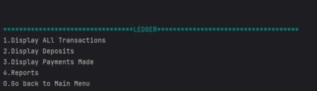

# 🤑 LE-FLIP — Buy • Sell • Profit

**LE-FLIP** is a Java console application for resellers to **track sales, purchases, and profits** 

The app allows you to:

- Record **sales and purchases**
- View **ledgers** and transaction histories
- Generate **pre-defined reports** or perform **custom searches**
- Calculate **balances, money spent, money earned, and net profit** for different periods

---

## 📋 Home Menu

The Home Page provide 4 options:

| Option | Description |
|--------|-------------|
| 1 | Add Sale (Sell Item) |
| 2 | Add Purchase (Buy Item) |
| 3 | Ledger |
| 4 | Balance Summary |
| 0 | Exit |
 
  
---

### 1️⃣ Add Sale (Sell Item)

When adding a sale, the app prompts for:

- **Name** – to who you are selling ?
- **Amount** – Sale price
- **Description** – what the item is or description 

**sample code to sale :**

```java
 while (!validAmount) { // loops until value is valid
            System.out.print("How much? Enter an amount ");
            try {
                amount = scanner.nextDouble();
                scanner.nextLine();
                validAmount = true;  // when input is valid this makes the loop exit

            } catch (InputMismatchException e) {
                System.out.println(bold+red+"Wrong Input! please enter an amount in $ "+reset);
                scanner.nextLine(); // clear invalid input entered
            }
        }
        // Ask for description input and handle wrong input for description
            System.out.print("what item are you selling  ");
            description = scanner.nextLine();
        // Ask for vendor input and handle wrong input for description
            System.out.print("To who(Vendor)??");
            vendor = scanner.nextLine();
}
```
### 2️⃣ Add Purchase (Buy Item)

When adding a purchase, it prompts for:

- **Vendor Name** – From where or who you're buying ?
- **Amount** – Sale price
- **Description** – description of the item


  3️⃣ Ledger

The Ledger menu has options to :
 



📊 Reports

reports include:


|  |                            |
|--------|----------------------------|
| 1 | Month To Date Transactions |
| 2 | Year To Date Transactions  |
| 3 | Previous Year Transactions |
| 4 | Custom Search              |
| 0 | Back                       |
 