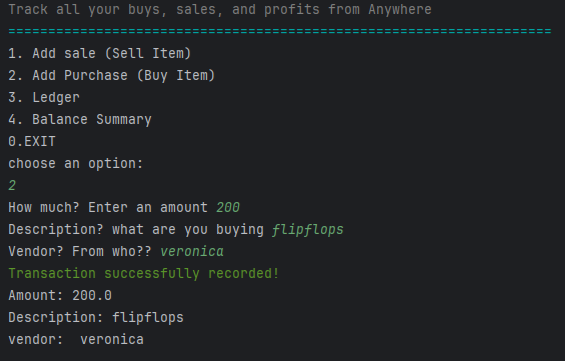
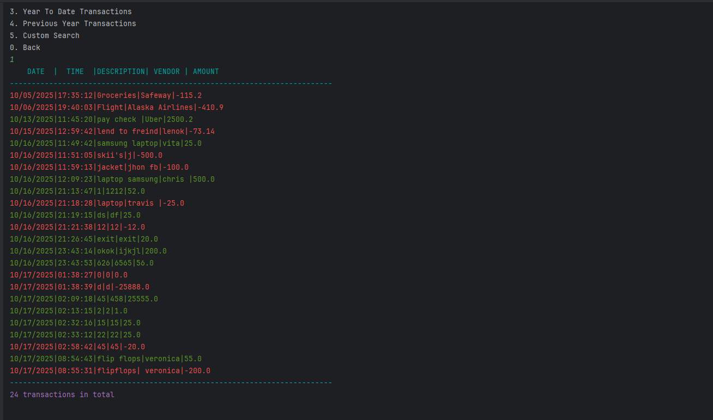
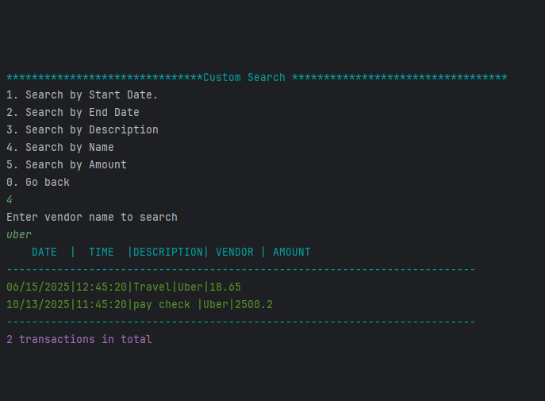
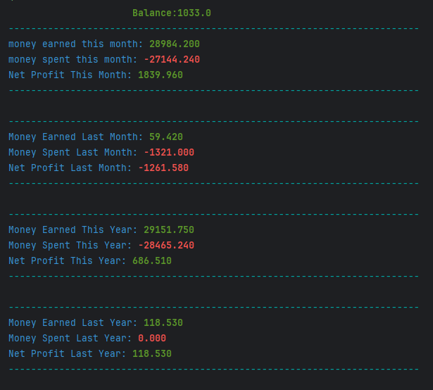

# 🤑 LE-FLIP — Buy • Sell • Profit

**LE-FLIP** is a Java console application for resellers to **track sales, purchases, and profits** 

The app allows you to:

- Record **sales and purchases**
- View **ledgers** and transaction histories
- Generate **pre-defined reports** or perform **custom searches**
- Calculate **balances, money spent, money earned, and net profit** for different periods

---
## 🌟 Features & Highlights

- 🎛️ CLI menu with emojis and ANSI-colored text
- 💰 Add deposits & make payments — cleanly saved
- 📄 View ledger, sorted with most recent first
- 📉 Built-in reports with real-time filters
- 🔍 Custom search
- 📊 Summary stats: income, expenses, and net profit
- 🚫 Smart error handling — app doesn’t crash on bad input

## 📑 Table of Contents
- [Home Menu](#home-menu)
- [Ledger](#Add Sale Sell Item)
- [Reports](#reports)
- [Balance Summary](#balance-summary)
- [How to Run](#how-to-run)
- [Screenshots](#screenshots)


## 📋 Home Menu

The Home Page provide 4 options:

| Option | Description |
|--------|-------------|
| 1 | Add Sale (Sell Item) |
| 2 | Add Purchase (Buy Item) |
| 3 | Ledger |
| 4 | Balance Summary |
| 0 | Exit |
 
  
---

## 1️⃣ Add Sale (Sell Item)

When adding a sale, the app prompts for:

- **Name** – to who you are selling ?
- **Amount** – Sale price
- **Description** – what the item is or description 

**sample code to sale :**

```java
 while (!validAmount) { // loops until value is valid
            System.out.print("How much? Enter an amount ");
            try {
                amount = scanner.nextDouble();
                scanner.nextLine();
                validAmount = true;  // when input is valid this makes the loop exit

            } catch (InputMismatchException e) {
                System.out.println(bold+red+"Wrong Input! please enter an amount in $ "+reset);
                scanner.nextLine(); // clear invalid input entered
            }
        }
        // Ask for description input and handle wrong input for description
            System.out.print("what item are you selling  ");
            description = scanner.nextLine();
        // Ask for vendor input and handle wrong input for description
            System.out.print("To who(Vendor)??");
            vendor = scanner.nextLine();
}
```
## 2️⃣ Add Purchase (Buy Item)

When adding a purchase, it prompts for:

- **Vendor Name** – From where or who you're buying ?
- **Amount** – Sale price
- **Description** – description of the item
 

 **Here's an example of how buying an item works in action:**


  


  ## 3️⃣ Ledger


**The Ledger menu has options to :**
 


## 📊 Reports

**And Reports has options for:**


|  |                            |
|--------|----------------------------|
| 1 | Month To Date Transactions |
| 2 | Year To Date Transactions  |
| 3 | Previous Year Transactions |
| 4 | Custom Search              |
| 0 | Back                       |

**Here's an example of a report output for Month to Date Transactions**




#### 🔎 Custom Search

Filter transactions with different options like.

|  |                           |
|--------|---------------------------|
| 1 | Search by Start Date |
| 2 | Search by End Date  |
| 3 | Search by Description |
| 4 | Search by Name             |
| 0 | Search by Amount                     |

**Here's an example of custom search by Name**





## 4️⃣Balance Summary

The Balance Summary calculates and displays :

 



## 💡 Interesting Code Snippet

You can enter "exit" for vendor name or description while buying and item or selling an item to cancel transaction  :
```java
if (description.equalsIgnoreCase("exit")) {
            validDescription = false;
            validVendor=false;
        }
        if(vendor.equalsIgnoreCase("exit")){
            validVendor=false;
            validDescription =false;
        }
if (validDescription) {
            try {
                FileWriter fileWriter = new FileWriter("transactions.csv", true);
                BufferedWriter bufWriter = new BufferedWriter(fileWriter);
                bufWriter.write("\n" + payment.getDate().format(dateFormatter) + "|" + payment.getTime().format(timeFormatter) + "|" + payment.getDescription() + "|" + payment.getVendor() + "|" + payment.getAmount());
                bufWriter.close();
                System.out.println(green + "Transaction successfully recorded!" + reset);
                System.out.println("Amount: " + amount + "\nDescription: " + description + "\nvendor: " + vendor);
            } catch (IOException e) {
                throw new RuntimeException(e);
            }
        }
        else{
            System.out.println(yellow+bold+"Transaction canceled"+reset);
        }
